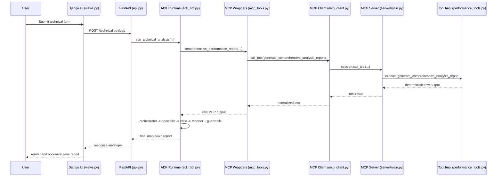
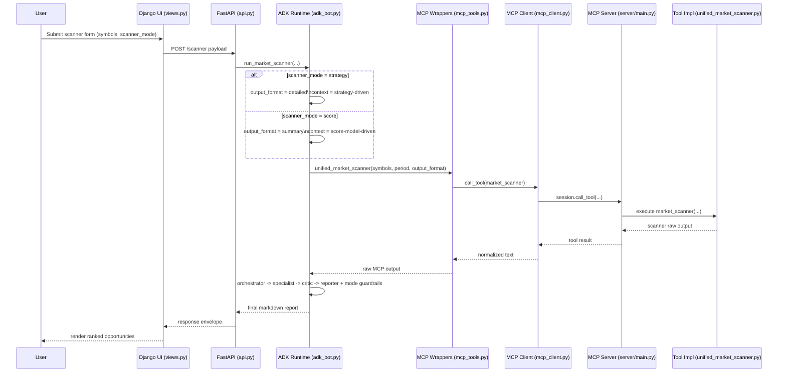

# MCP Financial Markets Analysis Tool — 60-Minute Technical Walkthrough

## 0) Session Goal and Audience

This document is designed for a **mixed technical audience** (engineering, architecture, product, data/AI ops) and intentionally avoids deep trading/financial concept teaching.

### What this walkthrough covers
- What the demo/MVP does
- Main components and technologies
- End-to-end workflow
- MCP server internals
- ADK bot internals and API surface
- UI architecture and key files

### What this walkthrough does **not** cover
- Detailed financial strategy theory
- Trading decision frameworks
- Investment advice

---

## 1) Introduction

## 1.1 What this demo/MVP does

At a high level, this project is a **modular AI analysis platform** that turns deterministic computational outputs into structured, human-readable reports.

It combines:
1. An **MCP server** that exposes analysis tools.
2. An **ADK agentic runtime** that orchestrates report generation and guardrails.
3. A **FastAPI layer** that standardizes external access.
4. A **Django UI** for operators to run analyses, tune request parameters, and store report history.

In practical terms, users submit a request (UI or API), the system runs deterministic tool calls, then ADK agents convert raw outputs into a governed report format.

## 1.2 Main components

- **MCP Compute Layer** (`server/`): registers and serves tool functions.
- **Agentic Orchestration Layer** (`stock_analyzer_bot/`): orchestrator + specialist + critic + reporter flow.
- **API Layer** (`stock_analyzer_bot/api.py`): typed contracts and endpoints.
- **UI Layer** (`django_ui/`): form-driven operations interface with account/session support.
- **Governance Layer** (`docs/analysis_strategy_catalog.json`): taxonomy + output constraints.

## 1.3 Main technologies

- **Python 3.10+**
- **FastMCP** for MCP server exposure
- **Google ADK** for multi-agent orchestration
- **FastAPI + Pydantic** for API contracts and runtime
- **Django** for UI, authentication, sessions, and report persistence
- **LiteLLM** integration in ADK path for model calling

## 1.4 End-to-end workflow

1. User submits request from UI or direct API client.
2. FastAPI validates payload and dispatches to the matching ADK runner.
3. ADK runner calls deterministic MCP wrappers (`mcp_tools.py`), which call the MCP server/toolchain.
4. ADK agent sequence processes outputs:
   - Orchestrator defines plan
   - Specialist drafts analysis
   - Critic performs quality checks
   - Reporter produces final output
5. Guardrails validate taxonomy/claim constraints and may rewrite or block invalid framing.
6. Final response is returned to caller (and can be saved in Django as report history).

## 1.5 Concrete request lifecycle (technical example)

Use this sequence when narrating a real `/technical` call from UI to report output.

1. **UI builds action payload**
  - `django_ui/analyzer/views.py` → `_payload_from_action(action, post_data)`
  - For `action == "technical"`, it builds:
    - endpoint: `technical`
    - payload: `symbol`, `period`, `technical_mode`, `risk_profile`

2. **UI sends HTTP request to backend**
  - `django_ui/analyzer/services.py` → `call_backend(api_url, endpoint, payload)`
  - Executes `POST {api_url}/technical`.

3. **FastAPI route validates and dispatches**
  - `stock_analyzer_bot/api.py` → `TechnicalAnalysisRequest`
  - `stock_analyzer_bot/api.py` → `technical_analysis(request)`
  - Route calls `run_technical_analysis(...)` via `run_in_threadpool(...)`.

4. **ADK runtime collects deterministic MCP output**
  - `stock_analyzer_bot/adk_bot.py` → `run_technical_analysis(...)`
  - In score mode, it calls `comprehensive_performance_report(symbol, period)`.
  - That wrapper lives in `stock_analyzer_bot/mcp_tools.py`.

5. **MCP wrapper invokes named MCP tool**
  - `stock_analyzer_bot/mcp_tools.py` → `_call_finance_tool(tool_name, parameters)`
  - For technical score flow it uses tool name:
    - `generate_comprehensive_analysis_report`

6. **MCP client opens/uses stdio session and executes tool call**
  - `stock_analyzer_bot/mcp_client.py` → `MCPFinanceSession`
  - Startup/lifecycle:
    - `_ensure_started()`
    - `_session_lifecycle()`
  - Invocation:
    - `call_tool(...)` → `_async_call_tool(...)` → `self._session.call_tool(...)`

7. **MCP server hosts and routes the tool implementation**
  - `server/main.py` creates `FastMCP("finance tools", "1.0.0")`
  - `register_all_tools(mcp)` wires all registrars from `server/tool_registry.py`
  - Server runs with stdio transport via `mcp.run(transport='stdio')`

8. **Concrete strategy/tool implementation executes**
  - `server/strategies/performance_tools.py` registers:
    - `@mcp.tool()`
    - `generate_comprehensive_analysis_report(symbol, period)`
  - This produces the deterministic raw analysis text returned to the ADK layer.

9. **ADK multi-agent pipeline transforms raw output into governed report**
  - `stock_analyzer_bot/adk_bot.py` → `_run_pipeline_sync(...)`
  - `AgenticFinancePipeline.execute(...)` runs:
    - orchestrator
    - financial specialist
    - critic
    - reporting specialist
  - Guardrails are applied through:
    - `_load_analysis_strategy_catalog()`
    - `_find_taxonomy_violations(...)`
  - Mode/risk header is added with `_with_mode_risk_header(...)` when applicable.

10. **Response returns to UI and can be persisted**
   - API returns standardized envelope (`report`, `symbol`, `analysis_type`, `duration_seconds`, etc.).
   - Django `index(request)` stores history in session and optionally saves `SavedReport` for authenticated users.

### Sequence diagram (technical call)

### Sequence diagram (scanner mode branch)

Legend:
- `technical_mode` applies to `/technical` and the technical branch inside `/combined`.
- `scanner_mode` applies to `/scanner` and `/multisector`.
- Both accept `strategy | score`, but they shape different route families.

---

## 2) MCP Server

## 2.1 Purpose in architecture

The MCP server is the **deterministic compute backend**. It provides callable tools that return structured outputs consumed by the ADK layer.

Think of it as the system’s **capability registry + execution plane**.

## 2.2 Main files

- `server/main.py`
  - Creates `FastMCP("finance tools", "1.0.0")`
  - Calls `register_all_tools(mcp)`
  - Runs server with stdio transport

- `server/tool_registry.py`
  - Centralized registration entrypoint
  - Imports all tool registration functions
  - Exposes:
    - `get_default_registrars()`
    - `register_all_tools(mcp, registrars=None)`

- `server/strategies/*`
  - Individual tool modules
  - Each module contributes one or more registration functions

## 2.3 How it works

### Registration lifecycle
1. Server starts.
2. Registry builds list of registrar functions.
3. Each registrar attaches tools to the FastMCP instance.
4. MCP clients can invoke these tools via the configured transport.

### Why this design is useful
- Easy to add/remove capabilities by updating registration.
- Separation between server bootstrapping and tool implementation.
- Deterministic outputs make downstream agent behavior more governable.

---

## 3) ADK Bot (Agentic Runtime + API)

## 3.1 Role in architecture

The ADK bot is the **intelligence and governance layer** between raw tool outputs and user-facing reports.

It handles:
- Agent orchestration
- Prompt/context shaping
- Mode/risk framing
- Taxonomy guardrails
- API endpoint integration

## 3.2 Main files

### Runtime orchestration files
- `stock_analyzer_bot/adk_bot.py`
  - Core agentic orchestration and report shaping
  - Taxonomy loading and enforcement
  - Mode/risk extraction and deterministic report metadata header
  - Per-route runner functions

- `stock_analyzer_bot/adk_bridge.py`
  - ADK bridge helper (`make_agent_caller`) to execute agent calls consistently

- `stock_analyzer_bot/mcp_tools.py`
  - Wrapper functions around MCP tool calls
  - Provides deterministic raw outputs to ADK runtime

- `stock_analyzer_bot/mcp_client.py`
  - MCP session lifecycle and connectivity management

### API file
- `stock_analyzer_bot/api.py`
  - FastAPI app definition
  - Pydantic request/response contracts
  - Route handlers and startup/shutdown hooks

## 3.3 Agentic app workflow

### Internal orchestration pattern
For each request, `adk_bot.py` generally follows this flow:

1. Build contextual contract
   - Action type, endpoint type (analysis/strategy), and guardrails
2. Collect raw deterministic tool output
3. Run ADK multi-agent sequence
   - Orchestrator → Specialist → Critic → Reporter
4. Validate report against governance checks
   - Detect unsupported claims, taxonomy violations, missing-evidence narratives
5. Apply deterministic metadata line for mode-aware routes
6. Return final markdown report + metadata payload

### Guardrail examples implemented
- Rejects/rewrites unsupported “data unavailable” claims when raw output exists.
- Enforces analysis-vs-strategy behavior boundaries.
- Applies explicit mode/risk context for selected routes.

## 3.4 API (external contract surface)

`stock_analyzer_bot/api.py` is the external contract for UI and clients.

### Route groups
- **System**
  - `/health`

- **Analysis routes**
  - `/technical`, `/scanner`, `/fundamental`, `/multisector`, `/combined`
  - `/trin`, `/overnight_gaps`, `/earnings_momentum`

- **Strategy routes**
  - `/bollinger_breakout`, `/gap_fade`, `/multi_timeframe`, `/pairs_trading`
  - `/statistical_arbitrage`, `/vix_term_structure`, `/volatility_regime`
  - `/bollinger_zscore_rsi`, `/bollinger_fibonacci`, `/macd_donchian`, `/dual_moving_average`

### Contract characteristics
- Strongly typed request schemas via Pydantic.
- Optional backward-compat fields retained where needed.
- Mode/risk fields supported on key analysis routes.
- Uniform response envelope with report and metadata.

---

## 4) UI (Django)

## 4.1 Purpose in architecture

The UI is an **operator console** for non-API users:
- Configure runtime settings
- Trigger analyses from form-based views
- Review outputs
- Save and download report history

## 4.2 Main files and responsibilities

- `django_ui/analyzer/views.py`
  - Main controller logic
  - Session settings/theme handling
  - Action-to-endpoint payload mapping
  - Calls backend and handles response/errors

- `django_ui/analyzer/templates/analyzer/index.html`
  - Primary interface with tabbed analysis/strategy forms
  - Includes mode/risk selectors for supported routes
  - Displays report content and user operations

- `django_ui/analyzer/services.py`
  - HTTP adapter to backend (`call_backend`)
  - Centralizes request call path and timeout behavior

- `django_ui/analyzer/models.py`
  - `SavedReport` persistence model
  - Stores markdown output and metadata per user

- `django_ui/analyzer/urls.py`
  - URL routing: index, auth actions, and report download

- `django_ui/analyzer/forms.py`
  - Form definitions for registration and payload utilities

## 4.3 UI request flow

1. User picks analysis type in `index.html`.
2. Form posts action to `views.py`.
3. `views.py` maps action to endpoint + payload (with validation/defaults).
4. `services.py` sends request to FastAPI backend.
5. Response is rendered and optionally persisted as `SavedReport`.

---

## 5) Practical Demo Script (60 minutes max)

Use this as a speaking plan.

### 0–8 min: Intro and architecture framing
- What the MVP does
- Component map and responsibilities

### 8–18 min: MCP server deep dive
- `server/main.py`
- `server/tool_registry.py`
- Registration model and extensibility

### 18–38 min: ADK bot + API deep dive
- `adk_bot.py` orchestration and guardrails
- `adk_bridge.py`, `mcp_tools.py`, `mcp_client.py`
- `api.py` contracts and route families

### 38–50 min: UI deep dive
- `views.py` mapping logic
- `index.html` operator workflow
- persistence via `SavedReport`

### 50–58 min: End-to-end request trace
- Follow one request across UI → API → ADK → MCP → response

### 58–60 min: Q&A / extension ideas
- Add a new endpoint flow
- Add new tool registration path
- Add new guardrail rule

---

## 6) Key takeaways for mixed technical audience

1. The system cleanly separates deterministic compute from generative interpretation.
2. Agentic orchestration is constrained by explicit taxonomy guardrails.
3. FastAPI provides stable integration contracts for UI and external clients.
4. Django UI offers a practical operational layer without requiring API-first usage.
5. The architecture is modular enough to extend tools, routes, and policies independently.

---

## 7) Recommended companion visuals

- Full runtime diagram: `docs/architecture_adk.svg`
- Agent-focused flow: `docs/architecture_adk_agents_workflow.svg`

These two diagrams together work well for a mixed audience: one for system context, one for agent internals.
