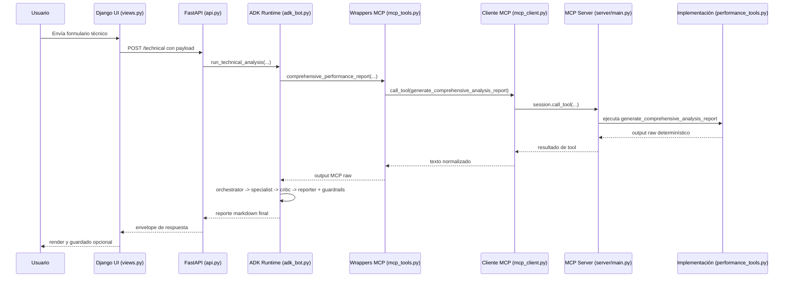
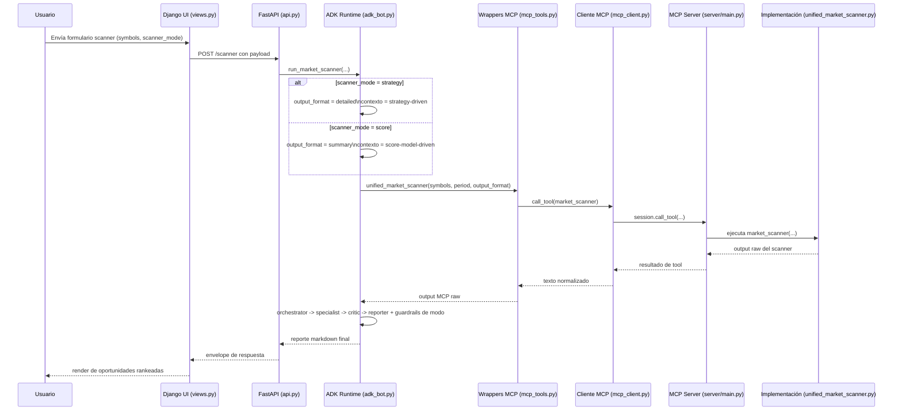

# MCP Financial Markets Analysis Tool — Guía Técnica (60 minutos)

## 0) Objetivo de la sesión y audiencia

Este documento está diseñado para una **audiencia técnica mixta** (engineering, architecture, product, data/AI ops) y evita entrar en teoría de trading.

### Qué cubre esta guía
- Qué hace este demo/MVP
- Componentes principales y tecnologías
- Flujo end-to-end
- MCP server
- ADK bot (agentic app + API)
- UI (archivos principales)

### Qué no cubre
- Explicación profunda de conceptos financieros
- Estrategias de inversión
- Recomendaciones de compra/venta

---

## 1) Introducción

## 1.1 ¿Qué hace este demo/MVP?

Este proyecto es una plataforma de análisis basada en AI que toma outputs determinísticos de herramientas y los convierte en reportes estructurados y auditables.

Combina:
1. **MCP server** para exponer herramientas de análisis.
2. **ADK agentic runtime** para orquestar generación de reportes con guardrails.
3. **FastAPI** como capa de contratos y endpoints.
4. **Django UI** para operación, configuración y gestión de reportes.

En práctica: usuario envía request (UI o API), el sistema ejecuta tools determinísticas, y luego agentes ADK generan un reporte final bajo reglas de gobernanza.

## 1.2 Componentes principales

- **MCP Compute Layer** (`server/`): registro y ejecución de tools.
- **Agentic Orchestration Layer** (`stock_analyzer_bot/`): orchestrator + specialist + critic + reporter.
- **API Layer** (`stock_analyzer_bot/api.py`): contratos tipados y endpoints.
- **UI Layer** (`django_ui/`): interfaz para ejecutar análisis y guardar historial.
- **Governance Layer** (`docs/analysis_strategy_catalog.json`): taxonomía y restricciones de salida.

## 1.3 Tecnologías principales

- **Python 3.10+**
- **FastMCP** para el MCP server
- **Google ADK** para multi-agent orchestration
- **FastAPI + Pydantic** para contratos y runtime HTTP
- **Django** para UI, auth, sesión y persistencia de reportes
- **LiteLLM** para integración de modelos en el flujo ADK

## 1.4 Flujo end-to-end

1. El usuario envía una solicitud desde UI o cliente API.
2. FastAPI valida el payload y enruta al runner correspondiente.
3. El runner ADK invoca wrappers MCP (`mcp_tools.py`), que ejecutan tools determinísticas.
4. Secuencia de agentes ADK:
   - Orchestrator define plan
   - Specialist construye borrador
   - Critic valida calidad/consistencia
   - Reporter produce el reporte final
5. Guardrails validan taxonomía y claims; pueden reescribir o bloquear.
6. Se retorna respuesta final al cliente (y opcionalmente se guarda en Django).

## 1.5 Ciclo concreto de una request (ejemplo técnico)

Usa esta secuencia para explicar una llamada real a `/technical` desde UI hasta el reporte final.

1. **La UI construye endpoint y payload**
  - `django_ui/analyzer/views.py` → `_payload_from_action(action, post_data)`
  - Para `action == "technical"`, genera:
    - endpoint: `technical`
    - payload: `symbol`, `period`, `technical_mode`, `risk_profile`

2. **La UI envía la request HTTP al backend**
  - `django_ui/analyzer/services.py` → `call_backend(api_url, endpoint, payload)`
  - Ejecuta `POST {api_url}/technical`.

3. **FastAPI valida y despacha al runner**
  - `stock_analyzer_bot/api.py` → `TechnicalAnalysisRequest`
  - `stock_analyzer_bot/api.py` → `technical_analysis(request)`
  - La ruta invoca `run_technical_analysis(...)` vía `run_in_threadpool(...)`.

4. **El runtime ADK obtiene output MCP determinístico**
  - `stock_analyzer_bot/adk_bot.py` → `run_technical_analysis(...)`
  - En modo score, llama a `comprehensive_performance_report(symbol, period)`.
  - Ese wrapper está en `stock_analyzer_bot/mcp_tools.py`.

5. **El wrapper MCP invoca la tool por nombre**
  - `stock_analyzer_bot/mcp_tools.py` → `_call_finance_tool(tool_name, parameters)`
  - Para technical (score), utiliza:
    - `generate_comprehensive_analysis_report`

6. **El cliente MCP abre/usa sesión stdio y ejecuta la invocación**
  - `stock_analyzer_bot/mcp_client.py` → `MCPFinanceSession`
  - Ciclo de vida:
    - `_ensure_started()`
    - `_session_lifecycle()`
  - Invocación:
    - `call_tool(...)` → `_async_call_tool(...)` → `self._session.call_tool(...)`

7. **El MCP server hospeda y enruta la implementación real**
  - `server/main.py` crea `FastMCP("finance tools", "1.0.0")`
  - `register_all_tools(mcp)` registra capacidades desde `server/tool_registry.py`
  - El server corre por stdio con `mcp.run(transport='stdio')`

8. **Se ejecuta la implementación concreta de estrategia/tool**
  - `server/strategies/performance_tools.py` registra:
    - `@mcp.tool()`
    - `generate_comprehensive_analysis_report(symbol, period)`
  - Esta función devuelve el análisis raw determinístico que regresa a ADK.

9. **El pipeline multi-agent ADK transforma raw output en reporte gobernado**
  - `stock_analyzer_bot/adk_bot.py` → `_run_pipeline_sync(...)`
  - `AgenticFinancePipeline.execute(...)` ejecuta:
    - orchestrator
    - financial specialist
    - critic
    - reporting specialist
  - Guardrails aplicados mediante:
    - `_load_analysis_strategy_catalog()`
    - `_find_taxonomy_violations(...)`
  - Si aplica, agrega cabecera modo/riesgo con `_with_mode_risk_header(...)`.

10. **La respuesta vuelve a la UI y puede persistirse**
   - API retorna envelope uniforme (`report`, `symbol`, `analysis_type`, `duration_seconds`, etc.).
   - Django `index(request)` guarda historial en sesión y opcionalmente persiste `SavedReport`.

### Diagrama de secuencia (llamada técnica)

### Diagrama de secuencia (rama de modo scanner)

Leyenda:
- `technical_mode` aplica a `/technical` y al bloque técnico dentro de `/combined`.
- `scanner_mode` aplica a `/scanner` y `/multisector`.
- Ambos aceptan `strategy | score`, pero gobiernan familias de rutas distintas.

---

## 2) MCP Server

## 2.1 Rol en la arquitectura

El MCP server es la capa de cómputo determinístico. Expone tools que luego consume la capa agentic.

Es, en esencia, el **registro de capacidades + execution plane**.

## 2.2 Archivos principales

- `server/main.py`
  - Inicializa `FastMCP("finance tools", "1.0.0")`
  - Ejecuta `register_all_tools(mcp)`
  - Levanta el server por `stdio`

- `server/tool_registry.py`
  - Punto central de registro de tools
  - Importa registradores desde `server/strategies/*`
  - Expone:
    - `get_default_registrars()`
    - `register_all_tools(mcp, registrars=None)`

- `server/strategies/*`
  - Módulos de tools por capacidad
  - Cada módulo registra una o varias funciones/tool endpoints

## 2.3 ¿Cómo funciona?

### Ciclo de registro
1. Arranca el server.
2. Se construye la lista de registradores.
3. Cada registrador añade tools al objeto FastMCP.
4. Los MCP clients pueden invocar esas tools.

### Ventajas del diseño
- Extensible: agregar/quitar tools con cambios mínimos.
- Separación clara entre bootstrap y lógica de tools.
- Output determinístico para mejor control de calidad en capa agentic.

---

## 3) ADK Bot

## 3.1 Rol en la arquitectura

El ADK bot es la capa de inteligencia y gobernanza entre raw tool output y reporte final para usuario.

Gestiona:
- Agent orchestration
- Context/prompt shaping
- Mode/risk framing
- Taxonomy guardrails
- Integración con API

## 3.2 Archivos principales

### Runtime agentic
- `stock_analyzer_bot/adk_bot.py`
  - Orquestación multi-agent
  - Carga y aplica taxonomía
  - Extrae/aplica contexto de modo y riesgo
  - Ejecuta validaciones de claims y post-checks
  - Define runners por ruta

- `stock_analyzer_bot/adk_bridge.py`
  - Bridge helper (`make_agent_caller`) para llamadas de agentes

- `stock_analyzer_bot/mcp_tools.py`
  - Wrappers de tools MCP usados por ADK

- `stock_analyzer_bot/mcp_client.py`
  - Gestión de sesión/connection lifecycle con MCP

### Capa API
- `stock_analyzer_bot/api.py`
  - FastAPI app
  - Request/response models con Pydantic
  - Endpoint handlers y hooks de startup/shutdown

## 3.3 Agentic app workflow

Para cada request, `adk_bot.py` sigue este patrón:

1. Construye contrato de contexto
   - Acción, tipo (analysis/strategy), reglas guardrail
2. Obtiene raw output determinístico desde MCP tools
3. Ejecuta secuencia ADK
   - Orchestrator → Specialist → Critic → Reporter
4. Valida salida contra reglas de gobernanza
   - Claims sin soporte, violaciones de taxonomía, etc.
5. Inserta metadata determinística en rutas mode-aware
6. Devuelve reporte markdown + metadatos

### Ejemplos de guardrails implementados
- Detecta claims de “falta de datos” cuando sí hay raw output.
- Refuerza límites entre comportamiento de rutas analysis vs strategy.
- Aplica contexto explícito para mode/risk en rutas seleccionadas.

## 3.4 API

`stock_analyzer_bot/api.py` es el contrato externo para UI y clients.

### Grupos de endpoints
- **System**
  - `/health`

- **Analysis routes**
  - `/technical`, `/scanner`, `/fundamental`, `/multisector`, `/combined`
  - `/trin`, `/overnight_gaps`, `/earnings_momentum`

- **Strategy routes**
  - `/bollinger_breakout`, `/gap_fade`, `/multi_timeframe`, `/pairs_trading`
  - `/statistical_arbitrage`, `/vix_term_structure`, `/volatility_regime`
  - `/bollinger_zscore_rsi`, `/bollinger_fibonacci`, `/macd_donchian`, `/dual_moving_average`

### Características del contrato
- Request schemas tipados con Pydantic.
- Campos de backward compatibility donde aplica.
- Soporte de mode/risk en rutas analysis clave.
- Response envelope uniforme con `report` + metadata.

---

## 4) UI (Django)

## 4.1 Rol en la arquitectura

La UI funciona como consola operativa:
- Configurar backend/model settings
- Ejecutar análisis sin usar cliente API manual
- Ver resultados
- Guardar y descargar reportes

## 4.2 Archivos principales y explicación

- `django_ui/analyzer/views.py`
  - Controlador principal
  - Manejo de sesión (settings/theme)
  - Mapeo `action -> endpoint + payload`
  - Lógica de ejecución y manejo de errores

- `django_ui/analyzer/templates/analyzer/index.html`
  - Interfaz principal con tabs por tipo de análisis/estrategia
  - Formularios con parámetros por endpoint
  - Selectores de modo/riesgo en rutas compatibles

- `django_ui/analyzer/services.py`
  - Adaptador HTTP a FastAPI (`call_backend`)
  - Centraliza request/timeout

- `django_ui/analyzer/models.py`
  - Modelo `SavedReport` para persistencia de resultados por usuario

- `django_ui/analyzer/urls.py`
  - Routing de index, login/logout/register, descarga de reportes

- `django_ui/analyzer/forms.py`
  - Formularios auxiliares (registro y validación de payload)

## 4.3 Flujo UI -> API

1. Usuario selecciona tipo de análisis en `index.html`.
2. Form POST llega a `views.py`.
3. `views.py` transforma inputs en payload backend.
4. `services.py` ejecuta POST al endpoint FastAPI.
5. La UI renderiza respuesta y puede persistirla como `SavedReport`.

---

## 5) Guion sugerido para sesión de 60 minutos

### 0–8 min: Introducción
- Problema que resuelve el MVP
- Mapa de componentes

### 8–18 min: MCP server
- `server/main.py`
- `server/tool_registry.py`
- Patrón de registro/extensión

### 18–38 min: ADK bot + API
- `adk_bot.py` (orquestación + guardrails)
- `adk_bridge.py`, `mcp_tools.py`, `mcp_client.py`
- `api.py` y contratos

### 38–50 min: UI
- `views.py` como orchestration controller
- `index.html` como superficie operativa
- Persistencia con `SavedReport`

### 50–58 min: Trazado end-to-end
- Seguir una request real por todas las capas

### 58–60 min: Cierre y Q&A
- Cómo extender tools/endpoints/guardrails

---

## 6) Mensajes clave para audiencia técnica mixta

1. La plataforma separa claramente cómputo determinístico de generación narrativa.
2. La capa agentic está gobernada por contratos explícitos (taxonomía + guardrails).
3. FastAPI ofrece un contrato estable para integraciones.
4. Django UI habilita operación diaria sin dependencia de clientes API externos.
5. La arquitectura es modular y extensible por componente.

---

## 7) Visuales recomendados durante la presentación

- Arquitectura completa: `docs/architecture_adk.svg`
- Flujo de agentes (enfoque): `docs/architecture_adk_agents_workflow.svg`

Usar ambos ayuda a explicar sistema completo y luego hacer zoom en la parte agentic.
