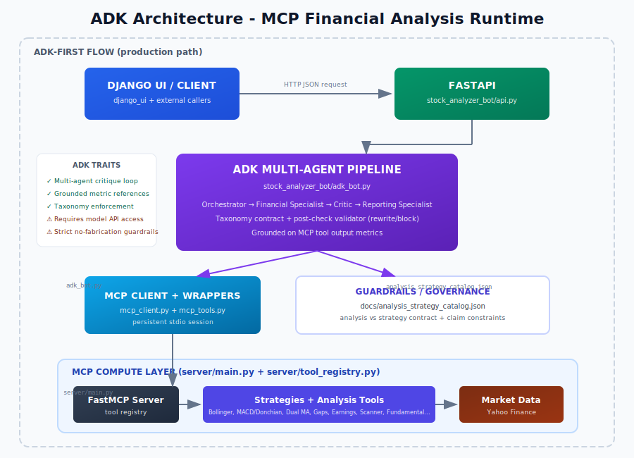
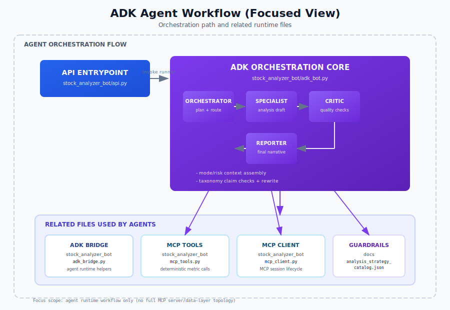
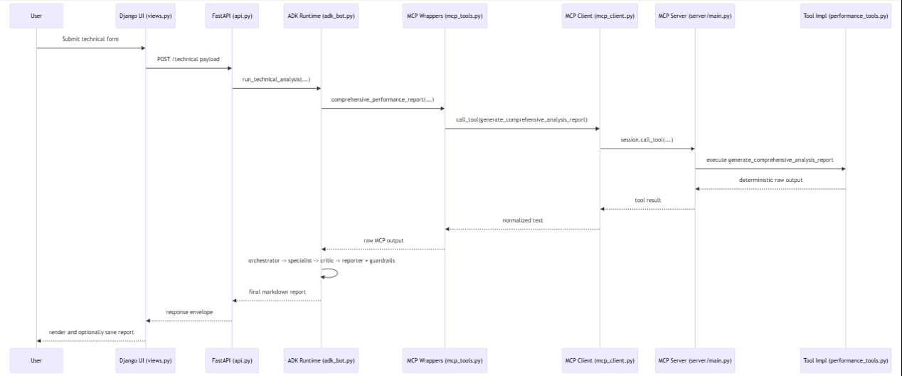
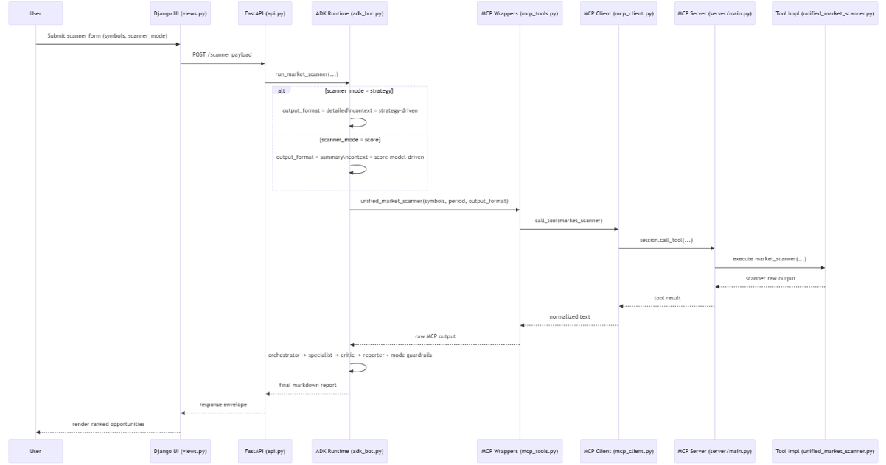

# 📊 MCP Financial Markets Analysis Tool

An AI-powered financial analysis platform that combines **Model Context Protocol (MCP)**, **Google ADK**, **FastAPI**, and **Django UI** to deliver professional-grade investment analysis reports. The system uses multi-agent orchestration to interpret MCP strategy outputs and produce grounded, guardrail-validated reports.

<p align="center">
  
  
  
  
  
</p>

---

## 🎯 Overview

This application provides **8 analysis routes + 11 standalone strategy routes** through a modern web interface (**19 functional routes**, excluding `/health`):

| Analysis Type | Description | Use Case |
|--------------|-------------|----------|
| **📈 Technical Analysis** | Strategy-consensus or score-synthesis on single stock | Deep dive into price patterns |
| **🔍 Market Scanner** | Compare multiple stocks simultaneously | Find best opportunities |
| **💰 Fundamental Analysis** | Financial statements interpretation | Assess company health |
| **🌐 Multi-Sector Analysis** | Cross-sector comparison | Portfolio diversification |
| **🔄 Combined Analysis** | Technical + Fundamental together | Complete investment thesis |
| **📊 TRIN Breadth** | Arms Index with rolling bands and signal context | Market breadth / risk-on risk-off read |
| **🌙 Overnight Gaps** | Prior close vs next open gaps, fill rates, same-day drift | Gap/midnight return behavior |
| **⚡ Earnings Momentum** | Volume-spike momentum scan with fixed hold window | Post-earnings breakout hunting |

## 🧪 Implemented Strategies (Explicit)

Analysis routes currently exposed:

- `POST /technical`
- `POST /scanner`
- `POST /fundamental`
- `POST /multisector`
- `POST /combined`
- `POST /trin` — [TRIN strategy flow](docs/trin_strategy.md)
- `POST /overnight_gaps` — [Overnight Gaps](docs/overnight_gaps_strategy.md)
- `POST /earnings_momentum` — [Earnings Momentum](docs/earnings_momentum_strategy.md)

Standalone strategy endpoints currently exposed:

- `POST /bollinger_breakout` — [Bollinger Breakout](docs/bollinger_breakout_strategy.md)
- `POST /gap_fade` — [Gap Fade](docs/gap_fade_strategy.md)
- `POST /multi_timeframe` — [Multi Timeframe](docs/multi_timeframe_strategy.md)
- `POST /pairs_trading` — [Pairs Trading](docs/pairs_trading_strategy.md)
- `POST /statistical_arbitrage` — [Statistical Arbitrage](docs/statistical_arbitrage_strategy.md)
- `POST /vix_term_structure` — [VIX Term Structure](docs/vix_term_structure_strategy.md)
- `POST /volatility_regime` — [Volatility Regime](docs/volatility_regime_strategy.md)
- `POST /bollinger_zscore_rsi` — [Bollinger Z-Score RSI](docs/bollinger_zscore_rsi_strategy.md)
- `POST /bollinger_fibonacci` — [Bollinger + Fibonacci](docs/bollinger_fibonacci_strategy.md)
- `POST /macd_donchian` — [MACD + Donchian](docs/macd_donchian_strategy.md)
- `POST /dual_moving_average` — [Dual Moving Average](docs/dual_moving_average_strategy.md)

Complete taxonomy reference: [analysis_strategy_catalog.md](docs/analysis_strategy_catalog.md)

Scoring classification reference: [strategy_scoring_classification.md](docs/strategy_scoring_classification.md)

### Registered Strategy Families (MCP)

Current MCP strategy families used directly or inside analysis routes:

1. Bollinger-Fibonacci
2. MACD-Donchian
3. Connors-ZScore
4. Dual Moving Average
5. Bollinger Z-Score
6. Bollinger Z-Score RSI
7. TRIN (Arms Index)
8. Overnight Gaps
9. Earnings Momentum
10. Bollinger Breakout
11. Gap Fade
12. Multi-Timeframe
13. Pairs Trading
14. Statistical Arbitrage
15. VIX Term Structure
16. Volatility Regime

### What Makes This Different?

Unlike traditional analysis tools that just display numbers, this system uses **AI to interpret** the data:

```
Traditional Tool: "RSI = 28.5, MACD = -2.3, P/E = 15.2"

This Application: "AAPL shows oversold conditions with RSI at 28.5, suggesting 
                   a potential mean reversion opportunity. Combined with strong 
                   fundamentals (P/E of 15.2 below sector average), this presents 
                   a BUY signal with high conviction..."
```

---
## 🤖 Current Agent Architecture (ADK)

The current application runtime is **ADK-first**.

- FastAPI endpoints call ADK orchestration in `stock_analyzer_bot/adk_bot.py`.
- ADK specialists/critic/reporter consume MCP tool outputs and produce grounded reports.
- Taxonomy guardrails are enforced using `docs/analysis_strategy_catalog.json`.
- Legacy smolagents files remain in repo as historical references, but are not the active backend path.

<p align="center">
  
</p>

- Full runtime architecture: [docs/architecture_adk.svg](docs/architecture_adk.svg)

<p align="center">
  
</p>

- Agent workflow (focused): [docs/architecture_adk_agents_workflow.svg](docs/architecture_adk_agents_workflow.svg)

### ADK flow highlights

1. **Django UI / API client** sends request to FastAPI.
2. **FastAPI** calls deterministic MCP tools and ADK analysis pipeline.
3. **ADK pipeline** runs orchestrator → specialist → critic → reporting agents.
4. **Guardrail layer** checks taxonomy compliance (analysis vs strategy) and can rewrite/block invalid outputs.
5. **Response** returns final report + metadata/timeseries.

### Concrete request lifecycle (technical example)

Use this sequence for a real `/technical` request from UI to final report.

1. **UI builds action payload**
  - `django_ui/analyzer/views.py` → `_payload_from_action(action, post_data)`
  - For `action == "technical"`, it builds `symbol`, `period`, `technical_mode`, `risk_profile`.

2. **UI sends HTTP request to backend**
  - `django_ui/analyzer/services.py` → `call_backend(api_url, endpoint, payload)`
  - Executes `POST {api_url}/technical`.

3. **FastAPI route validates and dispatches**
  - `stock_analyzer_bot/api.py` → `TechnicalAnalysisRequest`
  - `stock_analyzer_bot/api.py` → `technical_analysis(request)`
  - Route calls `run_technical_analysis(...)` via `run_in_threadpool(...)`.

4. **ADK runtime collects deterministic MCP output**
  - `stock_analyzer_bot/adk_bot.py` → `run_technical_analysis(...)`
  - In score mode, it calls `comprehensive_performance_report(symbol, period)`.

5. **MCP wrapper invokes named MCP tool**
  - `stock_analyzer_bot/mcp_tools.py` → `_call_finance_tool(tool_name, parameters)`
  - Tool name used in this path: `generate_comprehensive_analysis_report`.

6. **MCP client opens/uses stdio session and executes tool call**
  - `stock_analyzer_bot/mcp_client.py` → `MCPFinanceSession`
  - Invocation path: `call_tool(...)` → `_async_call_tool(...)` → `self._session.call_tool(...)`.

7. **MCP server hosts and routes implementation**
  - `server/main.py` creates `FastMCP("finance tools", "1.0.0")`
  - `register_all_tools(mcp)` wires registrars from `server/tool_registry.py`
  - Server runs with stdio transport via `mcp.run(transport='stdio')`.

8. **Tool implementation executes and returns raw output**
  - `server/strategies/performance_tools.py` registers `generate_comprehensive_analysis_report(symbol, period)` with `@mcp.tool()`.

9. **ADK multi-agent pipeline produces governed report**
  - `stock_analyzer_bot/adk_bot.py` → `_run_pipeline_sync(...)`
  - `AgenticFinancePipeline.execute(...)` runs orchestrator → specialist → critic → reporter.
  - Guardrails apply taxonomy and mode checks before returning.

10. **Response returns to UI and can be persisted**
   - API returns envelope (`report`, `symbol`, `analysis_type`, `duration_seconds`, etc.).
   - Django `index(request)` stores session history and can persist `SavedReport`.

<p align="center">
  
</p>

### Scanner mode branch (strategy vs score)

- `scanner_mode` drives scanner formatting path in `run_market_scanner(...)`:
  - `strategy` → `output_format="detailed"`
  - `score` → `output_format="summary"`
- Both paths call `unified_market_scanner(...)` and then the same ADK orchestration/guardrail pipeline.

Legend:
- `technical_mode` applies to `/technical` and the technical branch inside `/combined`.
- `scanner_mode` applies to `/scanner` and `/multisector`.
- Both accept `strategy | score`, but they govern different route families.

<p align="center">
  
</p>

---

## 🏗️ Architecture Overview

### Folder Structure

```
mcp_financial_markets_analysis_tool/
│
├── server/                          # MCP Server (Financial Tools)
│   ├── main.py                      # Server entry point
│   ├── strategies/                  # Trading strategy implementations
│   │   ├── bollinger_breakout.py    # Bollinger breakout strategy
│   │   ├── bollinger_fibonacci.py   # Bollinger + Fibonacci
│   │   ├── macd_donchian.py         # MACD + Donchian Channel
│   │   ├── connors_zscore.py        # Connors RSI + Z-Score
│   │   ├── dual_moving_average.py   # 50/200 EMA Crossover
│   │   ├── bollinger_zscore.py      # Bollinger + Z-Score
│   │   ├── bollinger_zscore_rsi.py  # Bollinger + Z-Score + RSI
│   │   ├── gap_fade.py              # Gap fade intraday strategy
│   │   ├── multi_timeframe.py       # Multi-timeframe trend strategy
│   │   ├── pairs_trading.py         # Pairs mean-reversion strategy
│   │   ├── statistical_arbitrage.py # Basket z-score arbitrage
│   │   ├── vix_term_structure.py    # Volatility curve regime strategy
│   │   ├── volatility_regime.py     # Risk regime allocation strategy
│   │   ├── trin_strategy.py         # TRIN breadth strategy
│   │   ├── overnight_gaps.py        # Overnight gap analysis strategy
│   │   ├── earnings_momentum.py     # Earnings momentum scan strategy
│   │   ├── fundamental_analysis.py  # Financial Statements (70+ row aliases)
│   │   ├── performance_tools.py     # Backtesting Tools
│   │   └── unified_market_scanner.py# Multi-Stock Scanner
│   ├── utils/
│   │   └── yahoo_finance_tools.py   # Data & Indicator Calculations
│   └── README.md                    # 📚 Detailed Server Documentation
│
├── stock_analyzer_bot/              # ADK Orchestration Runtime
│   ├── __init__.py
│   ├── adk_bot.py                   # ADK multi-agent pipeline + guardrails
│   ├── adk_bridge.py                # ADK bridge helpers
│   ├── main.py                      # ADK exports (compat module)
│   ├── api.py                       # FastAPI REST endpoints
│   ├── mcp_tools.py                 # MCP tool wrappers used by ADK
│   ├── mcp_client.py                # MCP connection manager
│   └── README.md                    # 📚 Detailed Bot Documentation
│
├── django_ui/                       # Main web frontend (Django)
│   └── analyzer/
│
├── docs/
│   ├── architecture_adk.svg         # ADK runtime diagram
│   ├── architecture_adk_agents_workflow.svg # ADK agent workflow diagram
│   └── Sectors_reference.md         # Sector symbols reference
│
├── streamlit_app.py                 # Legacy UI reference (optional)
├── .env                             # Environment variables
├── requirements.txt                 # Python dependencies
└── README.md                        # 📚 This file
```

### Data Flow Summary

Current ADK runtime flow:

1. **Django UI / HTTP client** sends analysis request
2. **FastAPI** validates payload and dispatches route
3. **MCP tools** compute raw metrics/timeseries
4. **ADK pipeline** synthesizes, critiques, and formats report
5. **Guardrails** enforce taxonomy and metric-grounding
6. **Client** receives response with report + metadata

---

## 🤖 ADK Runtime Notes

The active orchestration is implemented with **Google ADK** in `stock_analyzer_bot/adk_bot.py`.

- API routes call ADK runners (not smolagents runtime paths).
- MCP tools provide deterministic metrics/timeseries.
- ADK agents generate the narrative and apply critique.
- Taxonomy guardrails enforce strategy vs analysis behavior.

---

## 🔐 Security & Data Storage

Current persistence behavior in the Django UI layer:

- **User accounts:** Stored by Django Auth in `django_ui/db.sqlite3` with **salted password hashes** (not plain text).
- **Saved reports:** Stored in the `SavedReport` model (`title`, `analysis_type`, `symbol`, `duration_seconds`, `agent_type`, `markdown_report`, timestamps).
- **UI settings/theme/history:** Stored in Django sessions (`ui_settings`, `ui_theme`, `analysis_history`, `latest_result`).
- **ADK runtime session context:** In-memory only for agent runs (not durable across process restart unless external session storage is configured).

Operational notes:

- Do not commit `django_ui/db.sqlite3` to public repositories.
- Use production-grade DB/session backends (e.g., PostgreSQL + Redis) for multi-user deployments.
- Keep API keys in environment variables; avoid storing secrets in saved reports.

## 📱 Frontend

Current primary frontend is **Django UI** under `django_ui/`.

Legacy `streamlit_app.py` is optional and kept mainly for historical/demo usage.

---

## 🚀 Quick Start

### Prerequisites

- Python 3.10+
- OpenAI API key (recommended) or HuggingFace token
- Internet connection (Yahoo Finance data)

### Installation

```bash
# Clone the repository
git clone <repository-url>
cd mcp_financial_markets_analysis_tool

# Create virtual environment
python -m venv venv
source venv/bin/activate  # Linux/Mac
# or
.\venv\Scripts\activate   # Windows

# Install dependencies
pip install -r requirements.txt
```

### Environment Setup

Create a `.env` file in the project root:

```bash
# Required - LLM API Key (choose one)
OPENAI_API_KEY=sk-your-openai-key-here
# OR
HF_TOKEN=hf_your-huggingface-token

# ADK model configuration
ADK_MODEL_ID=gpt-4.1
ADK_MODEL_PROVIDER=openai

# Optional - Defaults
DEFAULT_ANALYSIS_PERIOD=1y
DEFAULT_SCANNER_SYMBOLS=AAPL,MSFT,GOOGL,AMZN
```

### Running the Application

```bash
# Terminal 1: Start the FastAPI backend
uvicorn stock_analyzer_bot.api:app --reload --port 8000

# Terminal 2: Start the Django frontend
python django_ui/manage.py runserver
```

Open your browser to `http://127.0.0.1:8000` (Django UI) or call API routes directly.

---

## 🔧 Core Components

### 1. MCP Server (`server/`)

The **Model Context Protocol Server** provides all financial analysis tools.

**Key Features:**
- Analysis + standalone strategy coverage aligned with ADK/MCP taxonomy
- Performance backtesting with metrics
- Fundamental analysis with 70+ row aliases for robust yfinance data extraction
- Multi-stock unified market scanner

📚 **Detailed Documentation:** [server/README.md](server/README.md)

### 2. Stock Analyzer Bot (`stock_analyzer_bot/`)

The **ADK-powered orchestration layer**.

**Key Files:**
- `adk_bot.py` - ADK multi-agent pipeline and guardrails
- `api.py` - FastAPI endpoints
- `mcp_tools.py` - MCP tool wrappers used by ADK
- `mcp_client.py` - MCP session lifecycle

📚 **Detailed Documentation:** [stock_analyzer_bot/README.md](stock_analyzer_bot/README.md)

### 3. Django Frontend (`django_ui/`)

The **main web interface** for operational use.

---

## 📡 API Reference

### Agent Runtime

All endpoints use ADK runtime (`agent_type` is kept only for backward compatibility and ignored by the server):

```json
{
  "symbol": "AAPL",
  "period": "1y",
  "technical_mode": "strategy",
  "risk_profile": "balanced",
  "agent_type": "adk_agentic"
}
```

`technical_mode` applies to `POST /technical` only and supports:
- `strategy` (default): synthesize standalone strategy outputs
- `score`: use high-level score model output

`risk_profile` applies to `POST /technical` only and supports:
- `conservative`: stricter downside-first framing
- `balanced` (default): neutral risk/reward framing
- `aggressive`: faster signal adoption with explicit higher-risk framing

`scanner_mode`/`multisector_mode` and `technical_mode` (inside `POST /combined`) support:
- `strategy` (default): strategy-consensus framing
- `score`: score-synthesis framing

`risk_profile` is also supported for `POST /scanner`, `POST /multisector`, and `POST /combined`
(applies to the technical branch for combined analysis).

`tools_approach` in API responses is mode-aware for these routes:
- `strategy`: `MCP tools + ADK strategy-consensus review`
- `score`: `MCP tools + ADK score-synthesis review`

### Available Endpoints

| Endpoint | Method | Type | Description |
|----------|--------|------|-------------|
| `/health` | GET | System | Health check, shows available agents |
| `/technical` | POST | Analysis | Single-stock technical report with `technical_mode` (`strategy`/`score`) and `risk_profile` (`conservative`/`balanced`/`aggressive`) |
| `/scanner` | POST | Analysis | Multi-stock comparison with `scanner_mode` (`strategy`/`score`) and `risk_profile` |
| `/fundamental` | POST | Analysis | Financial statement analysis |
| `/multisector` | POST | Analysis | Cross-sector analysis with `multisector_mode` (`strategy`/`score`) and `risk_profile` |
| `/combined` | POST | Analysis | Technical + Fundamental with technical-branch `technical_mode` (`strategy`/`score`) and `risk_profile` |
| `/earnings_momentum` | POST | Analysis | Volume-spike earnings momentum scan |
| `/trin` | POST | Analysis | Market breadth (TRIN) analysis |
| `/overnight_gaps` | POST | Analysis | Overnight gap behavior analysis |
| `/bollinger_breakout` | POST | Strategy | Bollinger breakout strategy report |
| `/gap_fade` | POST | Strategy | Gap fade strategy report |
| `/multi_timeframe` | POST | Strategy | Multi-timeframe trend strategy report |
| `/pairs_trading` | POST | Strategy | Pairs trading strategy report |
| `/statistical_arbitrage` | POST | Strategy | Statistical arbitrage strategy report |
| `/vix_term_structure` | POST | Strategy | VIX curve strategy report |
| `/volatility_regime` | POST | Strategy | Volatility regime strategy report |
| `/bollinger_zscore_rsi` | POST | Strategy | Bollinger + Z-Score + RSI report |
| `/bollinger_fibonacci` | POST | Strategy | Bollinger + Fibonacci report |
| `/macd_donchian` | POST | Strategy | MACD + Donchian report |
| `/dual_moving_average` | POST | Strategy | Dual moving average report |

### Response Format

```json
{
  "report": "# AAPL Comprehensive Technical Analysis\n...",
  "symbol": "AAPL",
  "analysis_type": "technical",
  "duration_seconds": 35.2,
  "agent_type": "adk_agentic",
  "tools_approach": "MCP tools + ADK multi-agent review"
}
```

For mode-aware routes (`/technical`, `/scanner`, `/multisector`, technical branch of `/combined`),
the report body starts with a deterministic metadata line, for example:

- `> Mode used: Technical=strategy | risk=balanced`
- `> Mode used: Scanner=score | risk=aggressive`

---

## ⚙️ Configuration

### Environment Variables

```bash
# LLM Configuration
OPENAI_API_KEY=sk-...           # Required for OpenAI models
HF_TOKEN=hf_...                 # Required for HuggingFace models
OPENAI_BASE_URL=                # Optional: Custom endpoint

# ADK Model Settings
ADK_MODEL_ID=gpt-4.1
ADK_MODEL_PROVIDER=openai

# Analysis Defaults
DEFAULT_ANALYSIS_PERIOD=1y
DEFAULT_SCANNER_SYMBOLS=AAPL,MSFT,GOOGL,AMZN
```

### Supported LLM Models

| Provider | Model ID | ADK Runtime Support |
|----------|----------|---------------------|
| OpenAI | `gpt-4.1` | ✅ Recommended |
| OpenAI | `gpt-4o` | ✅ Supported |
| OpenAI | `gpt-4o-mini` | ✅ Supported |
| Other via LiteLLM | provider/model | ⚠️ Validate output quality |

**Note:** Prefer stable, high-reliability models for critic/reporting consistency.

### Analysis Periods

Valid periods: `1d`, `5d`, `1mo`, `3mo`, `6mo`, `1y`, `2y`, `5y`, `10y`, `ytd`, `max`

---

## 📝 Output Formatting Rules

All analysis outputs follow strict formatting guidelines for clean rendering:

| Rule | Description |
|------|-------------|
| **Currency** | Use "USD" prefix instead of "$" (avoids LaTeX interpretation in Streamlit) |
| **Tables** | Avoid pipe characters in markdown tables (render poorly in UI) |
| **Data Points** | Each metric on its own line for clarity |
| **Headers** | Numbered sections with clear hierarchy |
| **No Italics** | Avoid `*text*` formatting |

### Strategy Count by Analysis Type

| Analysis Type | Tool Used | Strategies |
|--------------|-----------|------------|
| Technical Analysis (`technical_mode=strategy`) | `bollinger_fibonacci` + `macd_donchian` + `dual_moving_average` + `bollinger_zscore_rsi` | 4 strategies |
| Technical Analysis (`technical_mode=score`) | `comprehensive_performance_report` | 4-strategy synthesized score model |
| Market Scanner | `unified_market_scanner` | 5 strategies |
| Multi-Sector | `unified_market_scanner` | 5 strategies |

**Market Scanner Strategies:**
1. Bollinger Bands Z-Score
2. Bollinger Bands and Fibonacci Retracement
3. MACD-Donchian Combined
4. Connors RSI and Z-Score Combined
5. Dual Moving Average Crossover

---

## 🧪 Testing

### API smoke tests

```bash
python -c "import requests; r=requests.post('http://127.0.0.1:8000/technical', json={'symbol':'AAPL','period':'1y'}); print(r.status_code); print(r.json().get('analysis_type'))"
python -c "import requests; r=requests.post('http://127.0.0.1:8000/technical', json={'symbol':'AAPL','period':'1y','technical_mode':'score'}); print(r.status_code); print(r.json().get('analysis_type'))"
python -c "import requests; r=requests.post('http://127.0.0.1:8000/technical', json={'symbol':'AAPL','period':'1y','technical_mode':'strategy','risk_profile':'conservative'}); print(r.status_code); print(r.json().get('tools_approach'))"
python -c "import requests; r=requests.post('http://127.0.0.1:8000/scanner', json={'symbols':'AAPL,MSFT,NVDA','period':'1y','scanner_mode':'score','risk_profile':'aggressive'}); print(r.status_code); print(r.json().get('tools_approach'))"
python -c "import requests; r=requests.post('http://127.0.0.1:8000/multisector', json={'period':'1y','multisector_mode':'strategy','risk_profile':'conservative','sectors':[{'name':'Tech','symbols':'AAPL,MSFT,NVDA'},{'name':'Financials','symbols':'JPM,BAC,GS'}]}); print(r.status_code); print(r.json().get('analysis_type'))"
python -c "import requests; r=requests.post('http://127.0.0.1:8000/combined', json={'symbol':'AAPL','technical_period':'1y','fundamental_period':'3y','technical_mode':'score','risk_profile':'balanced'}); print(r.status_code); print(r.json().get('tools_approach'))"
python -c "import requests; r=requests.post('http://127.0.0.1:8000/macd_donchian', json={'symbol':'AAPL','period':'5y','fast_period':12,'slow_period':26,'signal_period':9,'window':20}); print(r.status_code); print(r.json().get('analysis_type'))"
```

### Compile checks

```bash
python -m py_compile stock_analyzer_bot/adk_bot.py stock_analyzer_bot/api.py
```

---

## 🔒 Security & Disclaimers

### Runtime Security

- Keep model/API credentials in `.env` only.
- Do not expose raw secrets in reports/logs.
- Keep taxonomy guardrails enabled for all analysis/strategy routes.

### Financial Disclaimer

⚠️ **IMPORTANT:** This software is for **educational and research purposes only**.

- All analysis results should be independently verified
- Past performance does not guarantee future results
- This is NOT financial advice
- Consult a licensed financial advisor before investing

---

## 🛠️ Troubleshooting

| Issue | Solution |
|-------|----------|
| "MCP server not found" | Verify `server/main.py` exists at project root |
| "Connection refused" | Start FastAPI with `uvicorn stock_analyzer_bot.api:app --port 8000` |
| "Timeout" | Reduce symbol scope or increase client timeout |
| "Guardrail blocked" | Check taxonomy contract and MCP-grounded claims |
| "Truncated output" | Use stronger model and reduce prompt verbosity |
| "LaTeX formatting errors" | Ensure code uses USD prefix instead of $ symbol |
| "Missing strategy metrics" | Verify MCP tool output includes `metrics` and `trades` payload |

---

## 🔄 Recent Changes

### v4.x - ADK Runtime Consolidation

- ADK-first orchestration for all API routes.
- Taxonomy catalog introduced for analysis vs strategy governance.
- Critic + deterministic post-check enforcement for non-grounded outputs.
- Strategy route tags aligned with catalog classification.
- Documentation updated with ADK architecture diagram.

---

## 📚 Additional Documentation

| Document | Description |
|----------|-------------|
| [server/README.md](server/README.md) | MCP Server tools, strategies, parameters |
| [stock_analyzer_bot/README.md](stock_analyzer_bot/README.md) | Agent implementations, API endpoints |
| [docs/Sectors_reference.md](docs/Sectors_reference.md) | Sector symbols and configuration |
| [docs/comprehensive_analysis_tool.md](docs/comprehensive_analysis_tool.md) | High-level single-stock technical report (4 strategies) |
| [docs/unified_market_scanner_tool.md](docs/unified_market_scanner_tool.md) | High-level multi-stock scanner (5 strategies) |
| [docs/fundamental_analysis_tool.md](docs/fundamental_analysis_tool.md) | Fundamentals-only MCP tool overview |
| [docs/combined_analysis_flow.md](docs/combined_analysis_flow.md) | Technical + fundamental combined flow (API/agent) |
| [docs/multi_sector_analysis_flow.md](docs/multi_sector_analysis_flow.md) | Multi-sector scanning flow (API/agent) |
| [docs/overnight_gaps_strategy.md](docs/overnight_gaps_strategy.md) | Overnight gaps tool and agent usage |
| [docs/earnings_momentum_strategy.md](docs/earnings_momentum_strategy.md) | Earnings momentum (volume spike) tool + agent usage |
| [docs/bollinger_fibonacci_strategy.md](docs/bollinger_fibonacci_strategy.md) | Low-level strategy: Bollinger Bands + Fibonacci |
| [docs/bollinger_zscore_strategy.md](docs/bollinger_zscore_strategy.md) | Low-level strategy: Bollinger Bands + Z-Score |
| [docs/macd_donchian_strategy.md](docs/macd_donchian_strategy.md) | Low-level strategy: MACD + Donchian |
| [docs/connors_zscore_strategy.md](docs/connors_zscore_strategy.md) | Low-level strategy: Connors RSI + Z-Score |
| [docs/dual_moving_average_strategy.md](docs/dual_moving_average_strategy.md) | Low-level strategy: Dual EMA crossover |
| [docs/strategy_scoring_classification.md](docs/strategy_scoring_classification.md) | Score-driven vs rule-driven MCP strategy classification |
| [docs/analysis_strategy_catalog.md](docs/analysis_strategy_catalog.md) | Authoritative analysis/strategy taxonomy |
| [docs/analysis_strategy_catalog.json](docs/analysis_strategy_catalog.json) | Machine-readable guardrail contract |

---

## 🤝 Contributing

1. Fork the repository
2. Create a feature branch
3. Implement your changes
4. Add tests if applicable
5. Submit a pull request

### Adding New Analysis/Strategy

1. Add/register MCP tool in `server/strategies/` + `server/tool_registry.py`.
2. Add wrapper in `stock_analyzer_bot/mcp_tools.py`.
3. Add ADK runner in `stock_analyzer_bot/adk_bot.py`.
4. Add endpoint/request model in `stock_analyzer_bot/api.py`.
5. Add taxonomy entry in `docs/analysis_strategy_catalog.json`.

---

## 📄 License

This project is provided for educational purposes. Users must comply with:
- Yahoo Finance Terms of Service
- OpenAI / HuggingFace Terms of Service
- Applicable local financial regulations

---

## 🙏 Acknowledgments

- [Google ADK](https://google.github.io/adk-docs/) for the multi-agent runtime foundation
- [FastMCP](https://github.com/jlowin/fastmcp) for MCP framework
- [yfinance](https://github.com/ranaroussi/yfinance) for market data
- [FastAPI](https://fastapi.tiangolo.com/) for REST API
- [Streamlit](https://streamlit.io/) for web interface

---


## Prompt Hacking Reference
- https://learnprompting.org/docs/prompt_hacking/introduction
